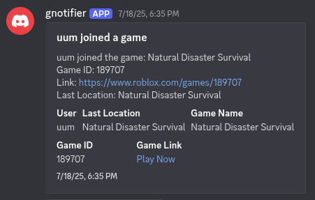
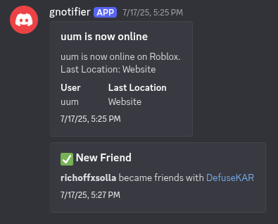

# gnotifier
A Javascript application to monitor Roblox profiles at your convenience.

## features
<!-- 
 -->
  <!-- 
presence monitoring
 -->
  ### presence monitoring
  - [x] Detects when a user goes **online / offline**
  - [x] Detects when a user **joins a game** (includes name, place ID, and join link)
  - [x] Detects when a user **leaves a game**
  - [x] Detects when a user’s **last location updates**
  - [x] Detects when a user plays in a **private game (joins off)**
<!-- 
 -->
<!-- 
 -->
  <!-- 
friend monitoring
 -->
  ### friend monitoring
  - [x] Detects when a user **adds a new friend**
  - [x] Detects when a user **removes a friend**
<!-- 
 -->
<!-- 
 -->
  <!-- 
follow monitoring
 -->
  ### follow monitoring
  - [x] Detects when a user **follows someone**
  - [x] Detects when a user **unfollows someone**
  - [ ] Detects when a user **gets followed** (soon)
  - [ ] Detects when a user **gets unfollowed** (soon)
<!-- 
 -->

## destinations
- [x] Discord DMs
- [ ] Email (deprecated due to spam)
- [ ] SMS (deprecated due to cost)

## note
This is purely a passion project. I do not have any intentions on monetizing any parts of this project, nor am I responsible for anything done with it, regardless if it's positive or negative.

## credits
* mischargings
* clt
